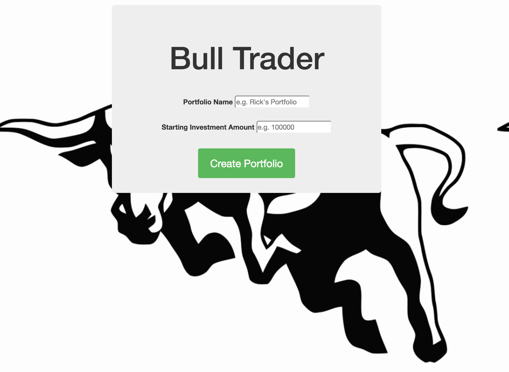

**Bull Trader Fullstack Capstone**
**Kyle Rogers**
**Jamie Wang**

*API Documentation*
Barchart API
https://www.barchartondemand.com/free
https://www.barchartondemand.com/api/getQuote
https://www.barchartondemand.com/api/getQuote/queries

*Description*
Bull Trader allows users to experiment with investment securities trading in a simulated environment to allow for risk free practice. All stock prices are displayed at 15minutes behind real time markets.  Users can search for stocks by ticker symbol, see the up to date price per share and select the number of shares they would like to purchase. All securities will be added to the user's portfolio immediately upon purchase. 

*Tech Stack*
HTML/CSS/JavaScript/jQuery/express/mongoDB/mongoose/

